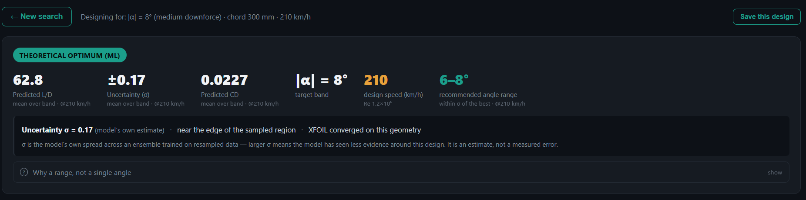
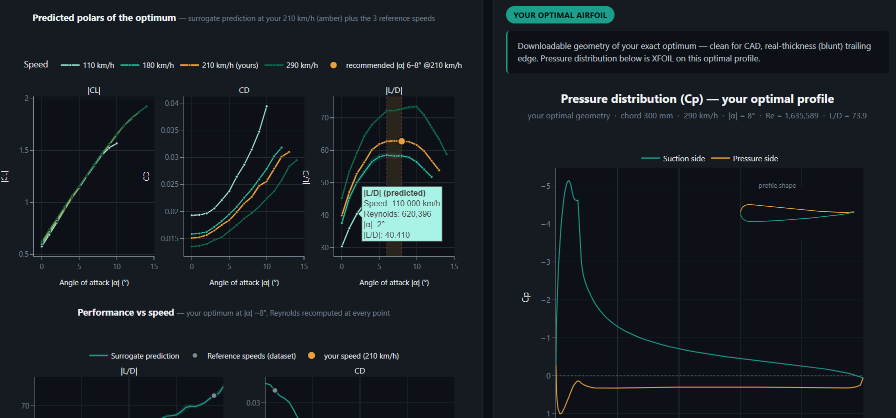
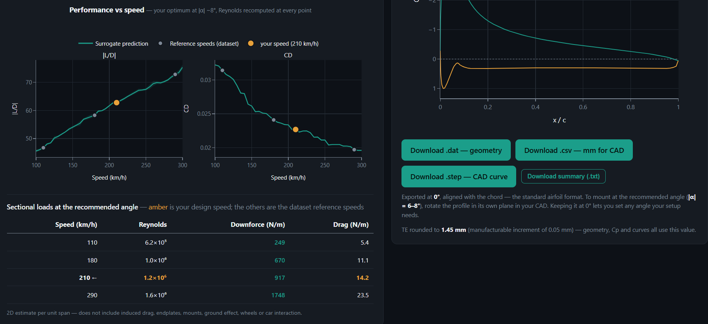

# Inverted Wing Designer

**Machine-learning inverse design of downforce aerofoils for motorsport — with the model's own uncertainty built into the optimisation.**

**▶ Live demo: [inverted-wing-designer.fly.dev](https://inverted-wing-designer.fly.dev)**

*Best viewed on desktop — the layout does not adapt to narrow screens. The first load can take a few seconds while the server wakes up.*

Tell it the circuit, the chord and the speed. It proposes a wing section, tells you how well it should perform, and — the part that matters — tells you how much to trust that number.

---

## The problem

Designing a racing wing section is slow. Each candidate geometry has to be built in CAD and solved in a viscous panel code, and a single evaluation is minutes of work. Searching a seven-parameter design space that way is impractical, so in practice you tweak a shape you already trust and hope.

This project replaces the inner loop. A dataset of **944 aerofoils, evaluated in XFOIL across 6 speeds and 1° angle steps (63,496 converged conditions)**, trains surrogate models that predict lift, drag and efficiency in milliseconds instead of minutes. An optimiser then searches the design space directly for the shape that best fits your target.

The interesting problem is what happens next. **Optimising against a model with error doesn't find the best shape — it finds the model's biggest mistake.** The optimiser is drawn to the corners of the design space where the surrogate is most over-optimistic, because that is where the predicted numbers look best. Measured on this project, in the first battery: geometries proposed without any correction underperformed their own prediction in **36 of 38 verified cases** (p < 10⁻⁷). Not noise — a systematic bias. It survives densification too, smaller but still there — see *Validation*.

So the optimiser here doesn't just chase the best prediction. It penalises the model's own uncertainty, and it refuses to be confident where it has no evidence. That correction, and the honest reporting of what the model does and doesn't know, is the point of the project.

Built end to end over several months: the CATIA airfoil-generation script, the point discretisation, the ~75k-row XFOIL dataset, the ML surrogates and the inverse optimiser were all designed and built for this project — including the dead-ends that shaped it.

---

## Screenshot



---

## Features

- **Inverse design from a target.** Pick a circuit (61 of them), a downforce level, or an exact angle band. Set chord (150–500 mm) and speed (95–330 km/h). Get a geometry.
- **Uncertainty reported, not hidden.** Every proposal carries σ from a bootstrap ensemble, its position against the measured catalogue, and explicit warnings when you leave the well-sampled region.
- **Recommended angle as a band, not a point.** If the model can't distinguish 6° from 7°, it says "6–7°" instead of inventing a precision it doesn't have.
- **Full aerodynamic report** — polars at multiple speeds, pressure distribution (Cp) computed in XFOIL on the proposed geometry, and sectional loads per unit span. When XFOIL fails to converge on that exact shape, the app falls back to the closest real profile in the measured catalogue and labels the plot as such, rather than presenting a substitute as if it were your design.


*Predicted CL, CD and L/D polars across four speeds — amber is your design speed — next to the XFOIL pressure distribution computed on the proposed geometry.*

- **Side-by-side comparison** of saved designs: overlaid polars, pressure distributions, and silhouettes at true scale in millimetres.
- **CAD export in three formats** — `.dat` (analysis), `.csv` in real millimetres, and `.step` as a native CAD curve, all from the same geometry. The STEP file has been validated by opening it in CATIA V5.
- **"The Method" view** — the validation evidence, presented honestly, including the results that are less flattering than they used to be.

---

## How it works

```
CATIA ──► point cloud ──► .dat ──► XFOIL ──► dataset ──► surrogates ──► inverse design
 (geometry)                        (truth)              (XGBoost)     (Sobol sweep, 32,768 pts)
```

**1. Data generation.** Each aerofoil is built parametrically in CATIA from 7 shape parameters, exported as a point cloud, converted to an XFOIL-ready profile with a real blunt trailing edge, and solved across a grid of angles and speeds. Reynolds number is derived from chord and speed, never assumed.

**2. Surrogate models.** Three XGBoost regressors predict CL, CD and L/D from **11 features**: the 7 shape parameters, angle of attack, Reynolds number, and two physically-motivated derived terms (`alpha/√Re` for the viscous regime, and trailing-edge thickness relative to chord).

Cross-validation uses **GroupKFold split by profile**, not by row. This matters: one aerofoil contributes **23 to 79 rows** (median 70) — the same shape at different angles and speeds — and those are not independent samples. A random split would leak the same geometry into both folds and report a score that doesn't exist.

| Target | MAE | R² |
|---|---|---|
| L/D | 1.896 | 0.920 |
| CL | 0.0208 | 0.987 |
| CD | 0.0016 | 0.903 |

**3. Inverse design.** The geometric family has 7 parameters, but you fix the chord, so the
search runs over the remaining **6**. Given a target, the app sweeps a Sobol sequence of
32,768 candidates across those 6 — bounded to the p5–p95 region actually covered by the
data — and takes the best. The objective is not the raw prediction:

```
J(x) = mean_ensemble(x) + k · σ(x)        minimised, k = 2
```

Because these are inverted wings, L/D is negative and more negative is better — so minimising `mean + k·σ` **adds a penalty wherever the model is unsure**, making uncertain corners less attractive no matter how good their headline number looks.

**4. Where σ comes from.** An ensemble of 10 XGBoost models, each trained on a bootstrap resample **of the profiles**, not of the rows. Resampling whole aerofoils respects the group structure and measures the right thing: epistemic uncertainty from sparse data. Where the design space is well covered, the ensemble members agree and σ is small; in thin regions they diverge and σ grows.

> Note: the spread between boosted trees within a single XGBoost model is *not* uncertainty — boosting builds sequential corrections, not independent predictors. That approach would work for a random forest; it doesn't here.

**5. Verification against the solver.** Proposals aren't trusted because the model likes them. Selected designs are rebuilt as real geometry in CATIA and re-solved in XFOIL, and the measured result is compared with the promise.


*What comes out the far end: performance and sectional loads versus speed, and the same geometry exported as `.dat`, `.csv` and `.step`.*

---

## Validation

**The validation is not a train/test split.** A **40-case battery** spanning three chord
bands, several speeds and several angle targets. Each case was optimised twice — once
with no uncertainty penalty (`k=0`) and once with `k=2` — and then **every one of the 80
resulting proposals was rebuilt as real parametric geometry in CATIA and re-solved in
XFOIL.** Eighty geometries through the full pipeline, not eighty rows held back from a
table.

That distinction is the point. A held-out split only tells you the surrogate interpolates
its own dataset. It cannot tell you whether the *optimiser* is exploiting the surrogate's
errors — for that you have to take what the optimiser proposes, build it, and measure it.
That is what these numbers are.

Both batteries below run those same 40 cases; the table reports the **denser** one, which
is the dataset the shipped models are trained on.

| | mean error vs XFOIL (denser battery) |
|---|---|
| `k=0` (chase the best prediction) | **6.9 %** |
| `k=2` (penalise uncertainty) | **2.8 %** — median 2.4 %, worst case 12.2 % |

> **On that 2.8 %:** it is **3.7 % before correcting one case**, and the correction is
> declared rather than absorbed. Case 10 returned a value that depended on XFOIL's
> *march path* (|L/D| = 101.3 stepping 2° at a time, 66.5 stepping 1°), was
> physically impossible — no profile among 160 real ones measured in that window
> exceeds 97.5 — and was **the only one of 38** where the three march paths disagreed;
> the other 37 matched bit for bit. The original value is retained in the results JSON
> alongside the correction and its date.

> **Which optimiser produced these geometries.** The 80 proposals were generated by
> `differential_evolution` in the offline battery scripts, then built in CATIA and solved
> in XFOIL. **The deployed app does not use that optimiser.** A web request cannot wait
> the ~150 s per case DE needs, so `inversa_service.py` sweeps 32,768 Sobol candidates and
> takes the argmin: same objective, same `k`, same bounds, same models — different search.
>
> The two searches do not agree. Pinning the angle so that the search is the only thing
> that differs (`comprueba_buscador.py`), the Sobol sweep loses to DE on the shared
> objective in **40 cases out of 40** — median **+1.27 %** in J, landing where the ensemble
> is **44 % less certain** (σ 0.489 vs 0.339) and up to **59 % of the parameter range**
> away in the worst single parameter.
>
> That is not a tuning gap, it is a different basin, and a cheap local refinement does not
> bridge it (`pulido_local.py`). L-BFGS-B never moves at all: J is piecewise constant over
> gradient-boosted trees, so its gradient is zero almost everywhere and the optimiser
> converges after d+1 = 7 evaluations without taking a step. Powell is derivative-free and
> does move — usually uphill, ending worse than where it started in most cases.
>
> **So the 2.8 % belongs to the DE geometries and is not claimed for what the app
> returns.** What the app proposes is scored with the same `k = 2` penalty inside the same
> data-backed bounds, but those specific geometries have not themselves been built and
> measured. Closing that would mean re-running the CATIA + XFOIL verification on the Sobol
> proposals. It has not been done.

Penalising uncertainty costs nothing in real performance. In the original battery, the measured L/D of the penalised proposal beat the unpenalised one in every case: `k=0` was chasing mirages.

**And a result worth reporting because it contradicted the expectation.** The 40 cases were run twice: once against the original dataset (the *first battery*, July) and again after densifying it (from 3 speeds to 6, and from 2° to 1° angle steps). Densification was expected to weaken the penalty and make `k=2` worse, since σ dropped ~40%. It didn't. Instead, **the `k=0` error collapsed from 21.5 % in the first battery to 6.9 % in the denser one** — the figure in the table above.

The winner's curse isn't a fixed property of the method — it is **the price of low-evidence corners**. Optimising against an imperfect model selects its largest positive error; densify where the model had little evidence and those corners stop existing, so the curse shrinks on its own. The bias is still measurable — **33 of 37** cases still underperform their `k=0` promise in the denser battery, against 36 of 38 in the first — just three times smaller in magnitude.

**One finding that is less flattering, kept anyway.** With the denser data, σ no longer correlates significantly with the observed error (Spearman ρ = 0.14, p = 0.42, versus ρ = 0.39, p = 0.017 before). σ has not broken — its range halved and the large errors it used to rank have disappeared — but it is now a **guardrail** (it refuses to be confident without data) rather than a fine-grained predictor of how wrong a proposal will be. The dashboard says so.

---

## Reproducibility

Every stochastic step is seeded, and the one artefact too large to commit is pinned by
hash rather than rebuilt:

- **Inverse design**: a fixed-seed Sobol sweep (32,768 points) scored against the ensemble.
  The same target returns the same geometry.
- **Cross-validation**: `GroupKFold` split **by profile**, so the 23–79 conditions of one
  aerofoil never straddle a fold.
- **Uncertainty ensemble**: 10 members with fixed seeds (`1000+i`) and fixed
  hyperparameters; `xgboost` is pinned to the exact version the committed models were
  trained with.
- **The ensemble (111 MB on disk, 106 MiB) is downloaded, not rebuilt.** It exceeds
  GitHub's file limit, so it is published as a release asset and fetched by
  `fetch_ensemble.py`, pinned to **SHA-256 `4d25eaf7…48fc7c`**. Local runs and the Docker
  image therefore use the *same bytes* as the 40-case battery, not an equivalent rebuild.

> **Why pinned rather than rebuilt, and the bug that forced it.** The image used to retrain
> the ensemble at build time. That does not reproduce the artefact — it produces a different
> one. Retraining the same code with the same seeds on Linux instead of Windows gave, on an
> identical design point, σ **0.354 against 0.278 (+27 %)**, and since `J = mean + k·σ`, a
> different σ moves the argmin: the deployed app was returning a **different geometry** from
> the validated code for the same circuit. The committed models never had this problem —
> their predictions are byte-identical across platforms. Only the retrained ensemble drifts,
> because the trees do not come out the same. Determinism was real *within* one environment
> (a rebuild here reproduces the file byte for byte, MD5 `444cf10b…`) and that was mistaken
> for determinism in general. Pinning the hash is what makes the guarantee portable.

`build_ensemble.py` remains as the record of how the artefact was built and as the recovery
path if the release is ever lost.

> ⚠️ It **does nothing if `ensemble_ld_sigma.joblib` already exists** — it prints a notice
> and exits **0**. That is deliberate, but it means timing or verifying it against an
> existing file finishes in seconds and reports success without having rebuilt anything.
> Delete the file first. (A real rebuild is **62.5 s**; the misleading run was 2.9 s.)

## A note on verification

Several findings in this project came from distrusting results that looked fine:

- A **trailing-edge geometry bug** — the conversion to XFOIL format was silently
  replacing the last 2.3 % of the chord with a straight cut, so the 7th design parameter
  barely reached the solver. Found by correlating the resulting TE gap against the
  parameter that was supposed to control it (r = 0.19, versus r = 0.92 for the cut width).
- A **spurious XFOIL convergence** — one battery case whose value changed depending on
  the solver's march path. Caught by asking whether the number was physically possible.
- A **CAD export that imported "successfully" and produced nothing** — the generic STEP
  entity is accepted by CATIA without a single error and then ignored. Only opening the
  file in the actual CAD revealed it; a clean import log proved nothing.

The structural validators written along the way (STEP entity checks, ensemble
reproduction checks) exist because of these, not before them.

---

## Tech stack

**Python** · **Flask** (web app, no framework beyond it) · **XGBoost** (surrogates and uncertainty ensemble) · **SciPy** (Sobol sampling, spline fitting; `differential_evolution` in the offline validation scripts) · **XFOIL** (viscous panel solver, ground truth) · **Plotly** (interactive charts) · **CATIA V5** (parametric geometry, generation only — not needed to run the app) · **pandas / NumPy** · **Docker**

---

## Running it locally

**Requirements:** Python 3.12, and [XFOIL](https://web.mit.edu/drela/Public/web/xfoil/) on your `PATH` (or pointed to by the `XFOIL_EXE` environment variable). CATIA is *not* required — it is only used to generate new geometry for the dataset.

```bash
pip install -r requirements.txt
python fetch_ensemble.py     # downloads the validated ensemble, SHA-256 checked
python dashboard_app.py      # http://127.0.0.1:5001
```

The uncertainty ensemble is a 111 MB artefact (106 MiB), too large for GitHub, so it is
published as a release asset instead of committed. `fetch_ensemble.py` downloads it and
verifies the SHA-256 before writing it; on any mismatch it exits non-zero rather than
carrying on. Use it in preference to `build_ensemble.py`: it gives you the exact bytes the
published results were measured with, whereas a local rebuild gives an equivalent ensemble
that is only byte-identical on the environment it was originally built on.

**Without XFOIL**, everything driven by the surrogate still works — design, KPIs, loads, silhouettes, comparison and all three export formats. Only the pressure-distribution plots degrade, to a notice rather than an error.

**With Docker:**

```bash
docker build -t wing-designer .
docker run -p 7860:7860 -e PORT=7860 wing-designer
```

---

## Roadmap

- **STEP export as a solid, not just a curve.** Currently the `.step` file contains the closed section curve, written in pure Python. Building a proper extruded solid would need a real geometry kernel (`cadquery-ocp`), which adds a ~45 MB binary dependency — worth it only once there is demand.
- **Server-side persistence.** Saved designs live in browser `localStorage` today, so they don't survive a change of machine.
- **Sectional loads along the span.** Loads are currently reported per unit span from 2D data; distributing them along a real wing needs a lifting-line or panel step.
- **Wider trailing-edge study.** TE thickness turned out to behave as a manufacturing constraint (1 mm minimum in composite) rather than a free aerodynamic variable. Confirming that with a proper sweep would close the question.

---

## Scope and honesty

Some limits worth stating plainly:

- Predictions are **XFOIL-calibrated, not wind-tunnel-calibrated**. XFOIL is a viscous panel method with known limits near stall and at low Reynolds numbers.
- **The training data is survivor-selected, and not uniformly.** XFOIL fails to converge on about **15 % of the attempted conditions**, and those failures are not random: they rise from ~3 % at shallow angles to **35 % at 10°**, and concentrate on **smaller chords**, i.e. lower Reynolds. In the high-downforce band (\|α\| 9–14°) only **72 % of conditions converge**, and the profiles that fail there have on average a **23 % smaller chord** and a **11 % thinner leading edge** than those that succeed. So in that band the model learns from the geometries XFOIL could solve, and **neither the surrogate nor σ has any information about the region it could not** — σ cannot flag a gap whose data never existed. This is the same mechanism that led us to exclude chords below 150 mm outright, and it is the most significant limitation of the work.
- Analysis is **2D**. Span, endplates, ground effect and three-dimensional flow are outside the model. Sectional loads are per unit span.
- The circuit-to-angle mapping is **guidance from the type of circuit**, not real setup data — which is not public. The app says so where you choose a circuit.
- Supported envelope: chord **150–500 mm**, speed **95–330 km/h**. Outside it, the app warns rather than silently extrapolating.

---

## Documentation

For the full technical record — dataset construction, every design decision and the
reasoning behind it, the bugs that shaped the project and why several "obvious" fixes
were rejected — see **[TECHNICAL_NOTES.md](TECHNICAL_NOTES.md)** (in Spanish, ~1,750 lines).

---

*MSc Motorsport Engineering thesis project.*
